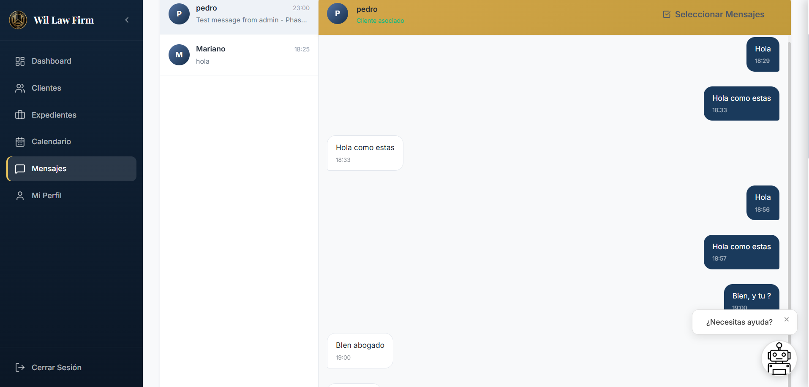

# Phase 5: Testing Instructions

## Pre-Testing Setup

### Verify Environment
```bash
# Terminal 1: Backend is running
curl http://localhost:5000/health

# Terminal 2: Frontend is running
# Open http://localhost:5174 in browser
```

### Browser Tools
- Open DevTools (F12)
- Network tab: Watch API calls
- Console: Check for errors
- Application → localStorage: View tokens and game data

---

## Testing Workflow

### Test 1: Authentication ✅
**Goal**: Verify login system works

**Steps**:
1. Click "Ingresar al Sistema"
2. Enter: `admin@wil.com` / `Admin2026`
3. Should see admin dashboard with sidebar

**Expected Result**:
- ✅ JWT token stored in localStorage
- ✅ User loaded in AppContext
- ✅ No console errors

---

### Test 2: Message Notifications (Admin→Client) 🔔
**Goal**: Test notification when admin sends message

**Setup**:
- Admin logged in
- Have 2 windows/tabs: one admin, one client (or use 2 browsers)

**Steps**:
1. In admin window: Click "Mensajes" in sidebar
2. Select client from conversation list
3. Type message: "Test notification message"
4. Send message
5. Switch to client window (or wait for poll)

**Expected Result**:
- ✅ Red badge appears on bell icon in TopBar (within 5 seconds)
- ✅ NotificationCenter shows new notification:
  - Title: "Nuevo Mensaje"
  - Message: "El Abogado: Test notification message..."
  - Icon: Mail icon
- ✅ Click notification → navigates to /cliente/mensajes
- ✅ Can mark as read
- ✅ Can delete notification

**Debug**:
```javascript
// In browser console (client window):
// Check notifications array
const { notifications } = window.__APP_STATE__; 
console.log(notifications);
```

---

### Test 3: Message Notifications (Client→Admin) 🔔
**Goal**: Test reverse notification flow

**Steps**:
1. Client sends message to admin
2. Switch to admin window

**Expected Result**:
- ✅ Badge appears on admin's bell
- ✅ Notification shows client message
- ✅ Mark as read works

---

### Test 4: New Appointment Notification 📅
**Goal**: Test appointment creation triggers notification

**Steps**:
1. Admin logged in
2. Click "Citas" → "Nueva Cita"
3. Fill in form:
   - Client: Select any client
   - Date: Use date picker
   - Time: Pick a time
   - Room: Auto-generated
4. Click "Agendar"
5. Check client's notifications

**Expected Result**:
- ✅ Client gets notification:
  - Title: "Nueva Cita Agendada"
  - Message: Shows date and time
  - Icon: Calendar icon
- ✅ Click navigates to /cliente/citas
- ✅ Database shows new appointment

**Debug in MongoDB**:
```javascript
// In MongoDB Atlas UI:
// Collection: appointments
// Should see new document with clientId, date, time
```

---

### Test 5: Update Appointment Notification 📅
**Goal**: Test notification only on date/time change

**Steps**:
1. Admin opens existing appointment
2. Click "Editar"
3. Change the date or time only (not room)
4. Click "Actualizar"
5. Check client's notifications

**Expected Result**:
- ✅ Client gets notification:
  - Title: "Cita Actualizada"
  - Message: Shows new date/time

**If you update only notes (not date/time)**:
- ✅ NO notification sent (correct behavior)

---

### Test 6: New Client Notification 👤
**Goal**: Test notification on client creation

**Steps**:
1. Admin logged in
2. Click "Clientes" → "+ Nuevo Cliente"
3. Fill form:
   - Name: "Test Client 1"
   - Email: `testclient1` (just username)
   - Password: Choose one
   - Phone: Optional
4. Click "Crear Cliente"
5. **Logged in as admin**, check notifications

**Expected Result**:
- ✅ Admin gets notification:
  - Title: "Nuevo Cliente Registrado"
  - Message: "Test Client 1 (testclient1@wil.com) ha sido creado..."
  - Icon: Users icon
- ✅ Click navigates to /admin/clientes
- ✅ New client visible in list
- ✅ New client can login with generated credentials

---

### Test 7: Cases CRUD 📦
**Goal**: Test complete cases workflow

**7A: Create Case**
1. Admin → "Expedientes" → "+ Nuevo Expediente"
2. Fill form:
   - Title: "Prueba de Caso"
   - Client: Select client
   - Priority: "Alta"
   - Status: "Activo"
   - Description: "Test description"
3. Click "Crear Expediente"

**Expected**:
- ✅ Case appears in table with MongoDB _id
- ✅ Status displays as "Activo" (not "active")
- ✅ Priority displays as "Alta" (not "alta")
- ✅ Client gets notification
- ✅ Database shows new case

**7B: View Case**
1. Click eye icon on case row
2. Modal opens with all details

**Expected**:
- ✅ All fields populated correctly
- ✅ Progress bar shows

**7C: Edit Case**
1. Click pencil icon on case row
2. Change status from "Activo" to "Pendiente"
3. Click "Actualizar"

**Expected**:
- ✅ Modal closes
- ✅ List updates with new status
- ✅ Client gets notification (because status changed)

**7D: Delete Case**
1. Click trash icon on case row
2. Confirm deletion

**Expected**:
- ✅ Case removed from list
- ✅ Confirmation dialog appeared before delete

---

### Test 8: Edit Client 👥
**Goal**: Test client profile editing

**Steps**:
1. Admin → "Clientes"
2. Find a client
3. Click edit (pencil) icon
4. Change name or phone
5. Click "Guardar Cambios"

**Expected Result**:
- ✅ Modal closes on success
- ✅ Client list updates with new data
- ✅ Changes persist on page reload
- ✅ Backend received request with JWT token

---

### Test 9: Notification Center Features 🔔
**Goal**: Test NotificationCenter functionality

**Steps**:
1. Generate several notifications (send messages, create appointments, etc.)
2. Click bell icon (top-right of TopBar)

**Expected Result**:
- ✅ Panel slides in from right
- ✅ Overlay is **transparent** (not dark)
- ✅ Clicking outside closes panel
- ✅ Shows all notifications in reverse chronological order
- ✅ Timestamps show relative time ("Hace 5 min")
- ✅ Icons display correctly (Mail, Calendar, Users, etc.)

**7A: Mark as Read**
- Click "Marcar como leído" on individual notification
- Badge count decreases
- Notification appears faded

**7B: Mark All as Read**
- Click "Marcar todas como leídas"
- All notifications become read
- Badge disappears

**7C: Delete**
- Click trash icon on notification
- Notification disappears from list

**7D: Navigation**
- Click notification
- Panel closes
- Route changes to specified URL

---

### Test 10: Responsive Design 📱
**Goal**: Test mobile/tablet layout

**Mobile Test (<640px)**:
1. Press F12 to open DevTools
2. Click device toggle (mobile phone icon)
3. Select "iPhone 12" or "Pixel 5"

**Expected**:
- ✅ Sidebar hidden (instead of on left)
- ✅ TopBar shows hamburger menu
- ✅ Content takes full width
- ✅ Modals are 90% width and centered
- ✅ Tables scroll horizontally
- ✅ Buttons are big enough to tap
- ✅ Text is readable without zoom
- ✅ No horizontal scrollbar on page

**Tablet Test (768px-1024px)**:
1. Select "iPad" in device menu

**Expected**:
- ✅ 2-column layout in some places
- ✅ Sidebar present but narrower
- ✅ Modals centered
- ✅ Tables show more columns

**Desktop Test (>1024px)**:
1. Resize browser to full width

**Expected**:
- ✅ Sidebar on left (full width)
- ✅ 3-column layouts where applicable
- ✅ Modals have good spacing

---

## Troubleshooting

### Issue: Notifications not appearing
**Debug Steps**:
```javascript
// Console
// 1. Check if polling is running
const app = document.querySelector('[data-notified]');
console.log(app);

// 2. Check AppContext state
// Look at React DevTools Profiler

// 3. Check backend logs
// Terminal where backend is running should show:
// [2026-03-25T22:38:42.314Z] GET /api/notifications
```

**Fix**:
- Wait 5 seconds (polling interval)
- Refresh page (Ctrl+R)
- Check backend is running: `curl http://localhost:5000/health`

### Issue: Modal doesn't close after creating client
**Status**: ✅ Fixed (was async/await issue, now resolved)

### Issue: Incorrect email display (@wil.com not showing)
**Status**: ✅ Working (frontend appends @wil.com correctly)

### Issue: Cases not loading from API
**Debug**:
```javascript
// Console:
// Check if cases loaded
JSON.stringify(cases, null, 2).slice(0, 500)

// Check network tab
// Should see GET /api/cases request
```

### Issue: Permission denied on case operations
**Cause**: Missing JWT token or admin role
**Fix**:
- Re-login as admin
- Check localStorage has `wil_auth_token`
- Check token in Network → Headers → Authorization

---

## Test Success Metrics

✅ **All Automatic**: 
- API requests have JWT tokens in headers
- Backend logs show request + response
- No 401/403 errors

✅ **User Workflows**:
- Can send message and receive notification
- Can create appointment and receive notification
- Can create client and receive notification
- Can create/edit/delete cases
- Can edit client profile

✅ **UI/UX**:
- Bell badge updates within 5 seconds
- NotificationCenter slides smoothly
- Modals appear/close without errors
- Responsive design works on mobile/tablet/desktop

✅ **Data Persistence**:
- Page reload preserves data
- Logout and login shows same data
- MongoDB contains all created data

---

## Final Checklist

Before considering Phase 5 complete:

- [ ] Login works for both admin and client
- [ ] At least one message notification tested
- [ ] At least one appointment notification tested
- [ ] At least one case created/edited/deleted
- [ ] NotificationCenter opens and shows notifications
- [ ] Mobile view works without errors
- [ ] Desktop view looks polished
- [ ] No console errors in DevTools
- [ ] Backend running smoothly (no 500 errors)
- [ ] All data persists correctly

---

**Ready to Test!** 🚀

Open browser to http://localhost:5174 and begin testing!
